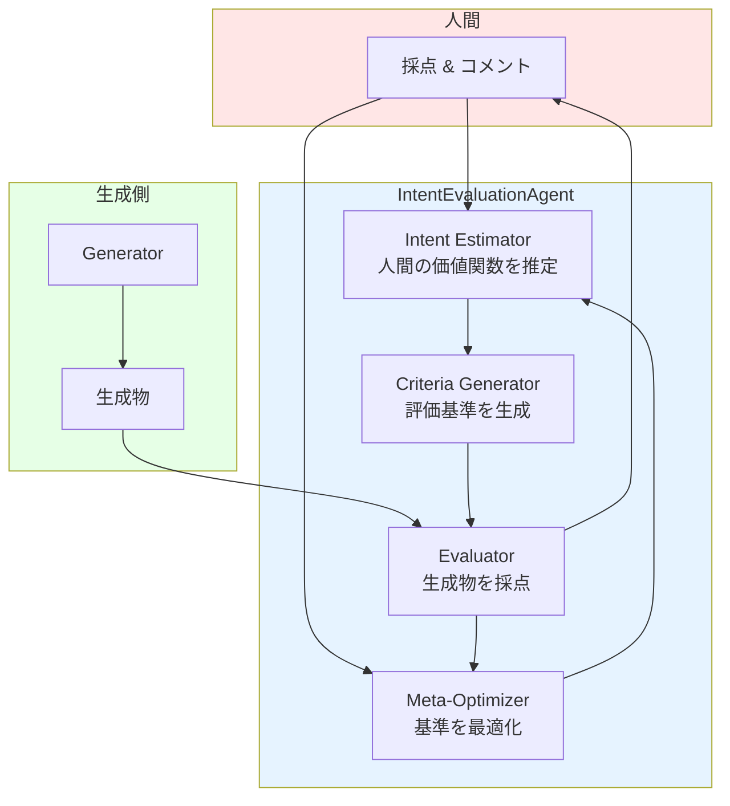
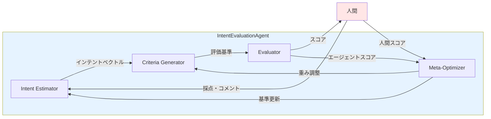
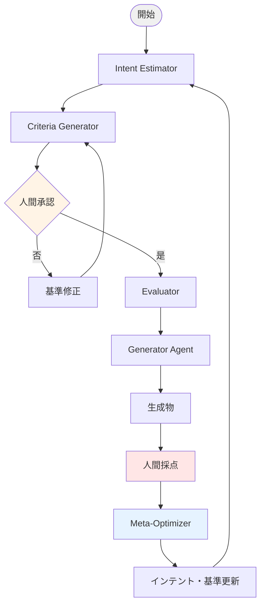
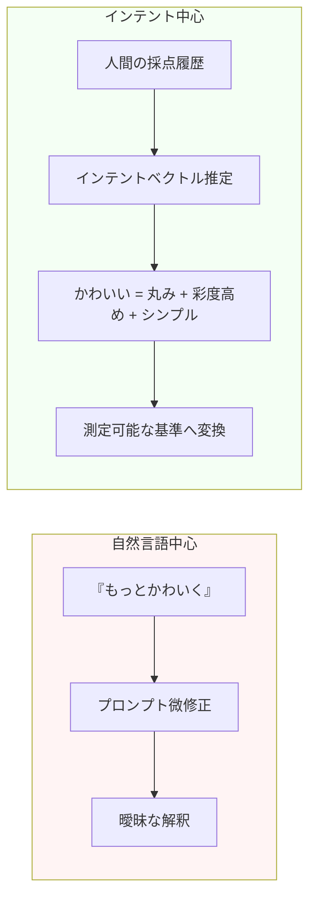
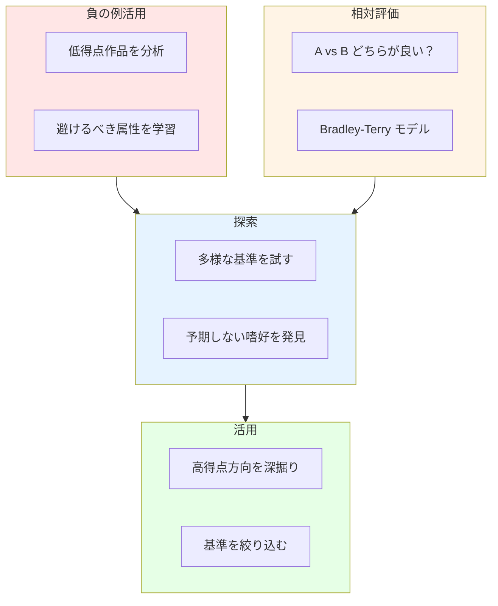

# インテント推定型評価エージェント設計

## コンセプト

> 自然言語のプロンプト調整ではなく、**人間が何を高く評価するか**を推定し、  
> そのインテント（意図）に合わせて評価基準を試行錯誤するエージェントを設計する。

## 全体像



## なぜインテント推定か

- 自然言語での「良くなれ」は曖昧で、同じ言葉でも人によって期待が違う。
- 人間の高得点には、しばしば言語化されていない嗜好・価値観・文脈が含まれる。
- したがって、**言葉そのものではなく、言葉の背後にある意図・価値関数**を推定すべき。

## ラング三兄弟の役割

| ツール | 役割 | この設計での使い方 |
|--------|------|------------------|
| **LangChain** | LLM との抽象化・ツール連携 | インテント推定、評価基準生成、スコアリングの Chain 構築 |
| **LangGraph** | 状態付きマルチエージェントワークフロー | 試行錯誤ループ、分岐、フィードバック遷移の制御 |
| **LangSmith** | 観測・評価・トレース | 人間スコアとエージェント評価の差分、軌跡の可視化 |

## エージェント構成



### 1. Intent Estimator（インテント推定器）

**目的**: 人間が何を求めているかを、言語化されない含意まで含めて推定する。

**入力**:
- 過去の生成物群
- 人間がつけたスコア
- 人間の短いコメント（任意）
- タスク文脈（画像生成 / 小説 / デザイン etc.）

**出力**:
- インテントベクトル（人間の価値観を数値ベクトル化）
- 重要度マップ（どの属性が高得点に寄与しているか）
- 言語化された仮説（「この人は○○を重視している」）

**実装案**:
```python
from langchain_core.runnables import RunnablePassthrough
from langchain_openai import ChatOpenAI

intent_chain = (
    {"history": RunnablePassthrough()}
    | prompt_template
    | llm.with_structured_output(IntentVector)
)
```

### 2. Criteria Generator（評価基準生成器）

**目的**: 推定されたインテントから、具体的で測定可能な評価基準を生成する。

**入力**:
- インテントベクトル
- タスク種別

**出力**:
- 評価軸リスト（例：「色の調和」「構図の大胆さ」「一貫性」）
- 各軸の重み
- スコアリングルビック（1-5 の基準）

**特徴**:
- 基準は可変。インテントの変化に応じて動的に追加・削除・再重み付け。
- 人間に提示し、承認または修正を受ける。

### 3. Evaluator（評価器）

**目的**: 生成物を現在の評価基準でスコアリングする。

**種類**:
- **自動評価**: 画像特徴量、文章指標、ルールベーススコア
- **LLM 評価**: 基準に基づく言語モデルによる採点
- **人間評価**: 最終的な正解ラベル

**出力**:
- 各評価軸のスコア
- 総合スコア
- 改善提案（次の生成に使う）

### 4. Meta-Optimizer（メタ最適化器）

**目的**: 人間スコアとエージェント評価の相関を最大化するように、インテント推定と評価基準を更新する。

**手法**:
- ベイズ最適化（Optuna）
- 遺伝的アルゴリズム（基準の組み合わせを進化）
- 強化学習（状態=インテント、行動=基準更新、報酬=相関係数）

**目的関数**:
```text
maximize  corr(人間スコア, エージェント総合スコア)
          - α * 基準数（複雑さペナルティ）
          + β * 多様性（過学習防止）
```

## LangGraph ワークフロー



## 状態管理（LangGraph State）

```python
class EvaluationState(TypedDict):
    task_context: str
    generated_items: List[GeneratedItem]
    human_scores: List[HumanScore]
    intent_vector: IntentVector
    criteria: List[Criterion]
    agent_scores: List[AgentScore]
    correlation_history: List[float]
    iteration: int
```

## 自然言語 vs インテント推定



## 自然言語よりインテントにフォーカスする理由

| 自然言語中心 | インテント中心 |
|-------------|---------------|
| プロンプトを微修正 | 人間の価値関数を推定 |
| 「もっとかわいく」→ 曖昧 | 「この人にとってかわいい= 丸み + 彩度高め + シンプル」→ 測定可能 |
| 言葉の解釈に振り回される | 行動（採点）から逆算 |
| 一人称の表現に依存 | 個人の嗜好をベクトル化し転用可能 |

## 人間の高得点を引き出す戦略



1. **探索と活用のバランス"
   - 初期は多様な基準を試す（探索）
   - 人間スコアが高い方向を深掘り（活用）

2. **負の例の活用**
   - 低得点作品から「避けるべき属性」を学習
   - 「良くない理由」は「良い理由」より情報量が多いことが多い

3. **相対評価の導入**
   - 絶対スコアではなく、A と B のどちらが良いかを人間に問う
   - ペアワイズ比較からインテントを推定（Bradley-Terry モデル等）

4. **意図の不一致検知**
   - エージェント評価と人間評価が大きくずれた場合、それは新しいインテントの発見機会
   - 「なぜずれたか」を説明させ、対話で修正

## 評価指標

| 指標 | 説明 |
|------|------|
| 人間・エージェント相関 | Spearman / Pearson 相関係数 |
| 順位一致率 | ペアワイズ比較の一致率 |
| 説明可能性 | なぜそのスコアかを人間が納得できるか |
| 収束速度 | 高相関に到達するまでの試行数 |
| 汎化性能 | 新しい生成物へのスコア予測精度 |

## 実装ステップ

1. **最小 Intent Estimator** を LangChain で作成
2. **固定基準 + LLM 評価** でエンドツーエンド動作確認
3. **LangSmith** で人間スコアとエージェントスコアの差分を可視化
4. **LangGraph** で反復ループを構築
5. **Meta-Optimizer** で基準重みを自動調整
6. 画像・小説双方で実験

## ファイル案

- `src/intent_estimator.py`
- `src/criteria_generator.py`
- `src/evaluator.py`
- `src/meta_optimizer.py`
- `src/graph.py` （LangGraph）
- `scripts/run_evaluation_loop.py`

## 他ドキュメントとの接続

- [evaluation-loop.md](./evaluation-loop.md): ループ全体のデータフロー
- [ml-kaggle.md](./ml-kaggle.md): 相関最大化の ML 手法
- [visualization.md](./visualization.md): インテントベクトルと相関の可視化
