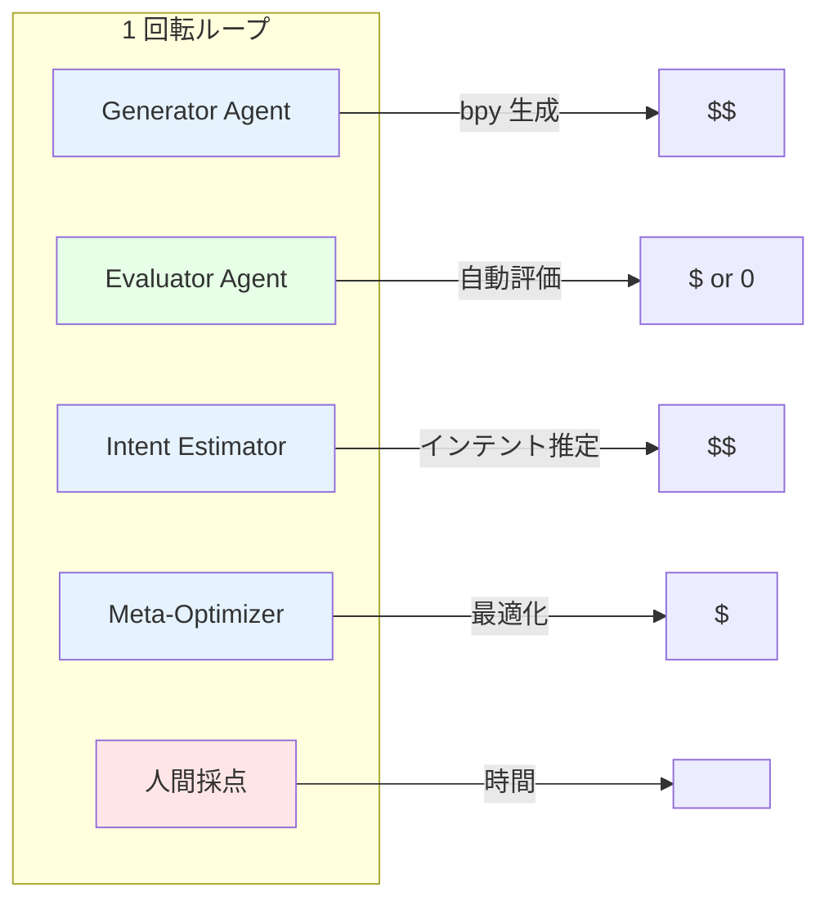
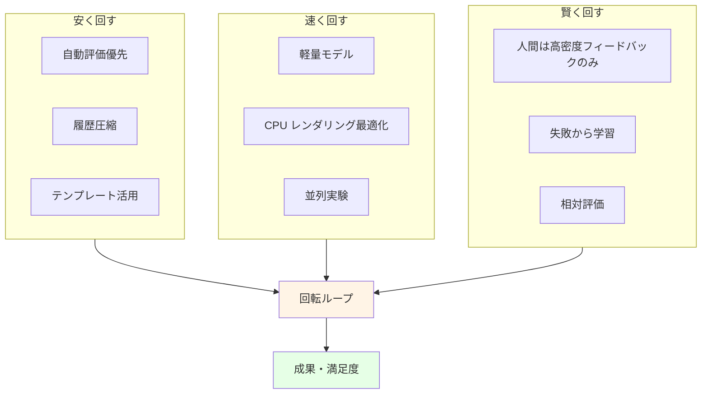

# コスト管理：ループを回し続けるための設計

## 前提

> token はフリーではない。bpy コードを書かせるのもお金がかかる。  
> したがって、**回転ループをなるべく回す**ことを課題にするなら、  
> 1 回あたりのコストを抑え、同じ予算でより多くの試行錯誤を行う設計が必要。

## 目標

- **成果（Outcome）**: ループ回数 × 改善幅
- **満足度（Satisfaction）**: 人間が納得する出力が得られるまでの時間とコスト
- **制約**: 限られた予算・トークン数の中で、最も効率的にループを回す

## コストの種類

### 1. LLM/VLM API コスト

| 用途 | 発生箇所 | 削減策 |
|------|---------|--------|
| インテント推定 | Intent Estimator Agent | 軽量モデル、履歴要約後に入力 |
| 評価基準生成 | Criteria Generator | テンプレート + 差分更新のみ |
| 評価スコアリング | Evaluator Agent | 自動評価優先、LLM は必要な時のみ |
| bpy コード生成 | Generator Agent | テンプレートベース、差分のみ生成 |
| 改善指示生成 | Meta-Optimizer | 構造化出力、短いプロンプト |

### 2. ローカル実行コスト

| 項目 | 内容 | 備考 |
|------|------|------|
| 電気代 | CPU レンダリング、モデル推論 | 小規模なら無視できる |
| ハードウェア磨耗 | 24h 運転の場合 | 無視できない場合も |
| 時間コスト | ループ 1 回あたりの所要時間 | 待ち時間もコスト |

### 3. 人間コスト（最も高い）

| 項目 | 内容 | 削減策 |
|------|------|--------|
| 採点時間 | 人間が生成物を見て評価 | 相対評価、バッチ評価、候補絞り込み |
| コメント時間 | なぜそのスコアかを言語化 | テンプレート選択式 |
| 承認時間 | 基準や生成物の確認 | 信頼性向上後は自動承認 |

## 回転ループあたりのコスト構造



## コスト削減戦略

### 1. ループ内で LLM を呼ぶ回数を減らす

```text
悪い例：
  生成 → LLM評価 → LLM改善 → 人間採点 → LLMインテント更新 → LLM基準更新

良い例：
  生成 → 自動評価（無料） → 人間採点 → インテント更新（LLM、ただし要約入力）
       → 次の N 回分の基準を一括生成
```

### 2. 履歴を圧縮してから LLM に渡す

- 全履歴をそのまま渡すとトークンが爆発する。
- 要約、クラスタリング、重要な失敗例のみ抽出してから渡す。

### 3. 自動評価で候補を絞り込み、人間評価は上位のみ

- 自動評価スコアが低いものは人間に見せない。
- 人間の時間を節約し、高密度なフィードバックを得る。

### 4. 小さな実験を並列で回す

- 1 つの大きなループより、小さな独立した実験を多数回す。
- 失敗しても捨てやすく、成功パターンを早く発見。

### 5. テンプレートと差分生成

- bpy コードを毎回ゼロから生成するのではなく、
  テンプレート + 差分パラメータで済ませる。
- SVG 生成も同様。

## 満足度・成果指標

### 成果（Outcome）

| 指標 | 説明 |
|------|------|
| ループ回数 | 予算内で何回回せたか |
| 改善率 | 初期スコアから最終スコアまでの上昇率 |
| 採用率 | 人間が採用・OK とした生成物の割合 |
| 知見数 | 発見した成功/失敗パターンの数 |

### 満足度（Satisfaction）

| 指標 | 説明 |
|------|------|
| 納得までのループ数 | 人間が「これだ」と思うまでの試行数 |
| コストあたり満足度 | 満足出力 1 件あたりの総コスト |
| 待ち時間 | 1 ループあたりの待ち時間 |
| 操作負荷 | 人間が介入する必要がある頻度 |

## コストシミュレーション例

### 前提

- 1 日 30 ループ
- 月 20 営業日 = 600 ループ/月

### パターン A：全て LLM 評価

| 項目 | 単価 | 回数/月 | コスト |
|------|------|--------|--------|
| Generator（bpy 生成） | 1000 tokens × ￥0.075/1k | 600 | ￥45 |
| Evaluator（LLM） | 1500 tokens × ￥0.075/1k | 600 | ￥67.5 |
| Intent Estimator | 2000 tokens × ￥0.075/1k | 600 | ￥90 |
| Meta-Optimizer | 1000 tokens × ￥0.075/1k | 600 | ￥45 |
| **合計** | | | **￥247.5/月** |

### パターン B：自動評価優先 + LLM は最小限

| 項目 | 単価 | 回数/月 | コスト |
|------|------|--------|--------|
| Generator（bpy 生成） | 1000 tokens × ￥0.075/1k | 600 | ￥45 |
| Evaluator（自動：CLIP/OpenCV） | ￥0 | 600 | ￥0 |
| Intent Estimator（要約入力） | 500 tokens × ￥0.075/1k | 100 | ￥3.75 |
| Meta-Optimizer | 500 tokens × ￥0.075/1k | 50 | ￥1.875 |
| **合計** | | | **￥50.6/月** |

→ 同じ予算で約 5 倍のループ回数が可能。

## コスト管理の運用ルール

1. **予算を事前に決める**
   - 月あたりの API 予算を設定
   - 1 ループあたりの目標コストを設定

2. **コストを計測する**
   - 各 Agent ごとに token 数を記録
   - LangSmith や自前ログで追跡

3. **閾値で動作を変える**
   - 予算 80% 到達 → 自動評価のみ
   - 予算 95% 到達 → 人間介入必須

4. **成果を定期的に確認**
   - コストあたり成果が悪ければ設計を見直す
   - 高コスト Agent が本当に価値を生んでいるか検証

## 回転ループを回し続けるための設計原則



## 関連ファイル

- [mcp-a2a-redesign.md](./mcp-a2a-redesign.md): CPU 16GB + MCP/A2A アーキテクチャ
- [data-collection-focus.md](./data-collection-focus.md): データをとる行為
- [intent-evaluation-agent.md](./intent-evaluation-agent.md): インテント推定エージェント
