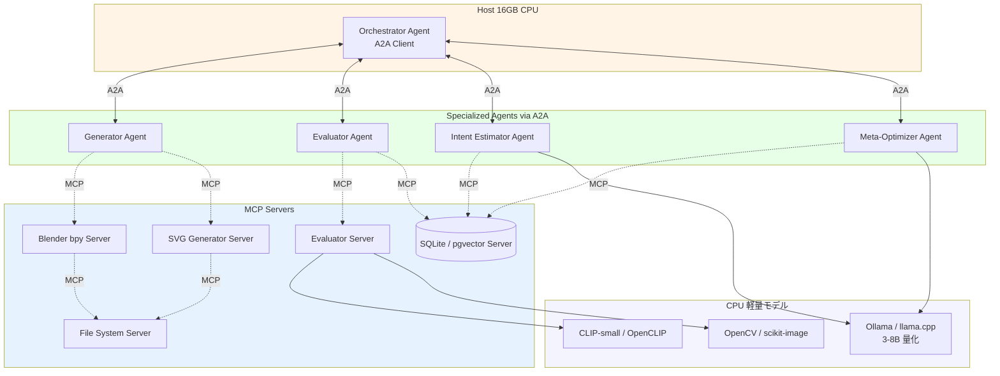
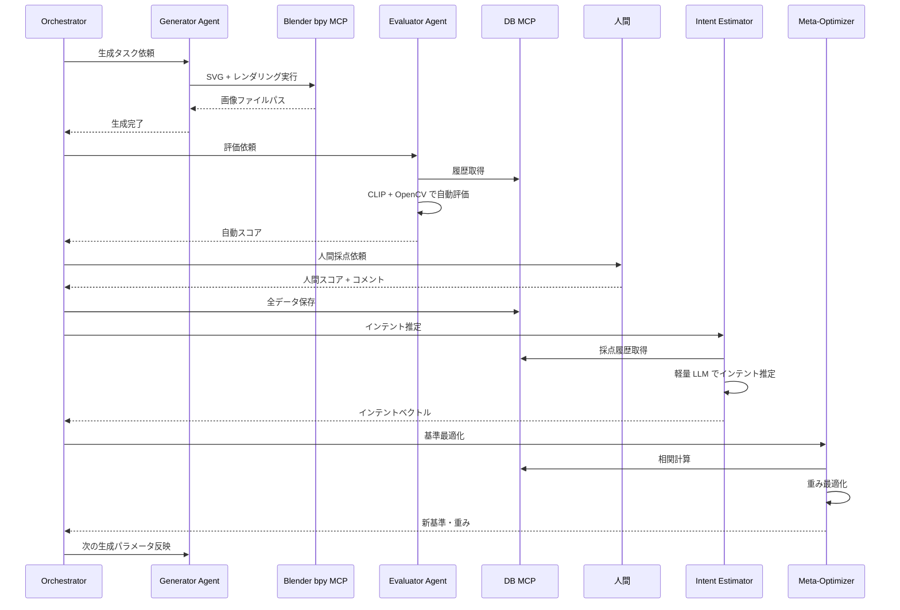

# MCP/A2A + CPU 16GB によるビジュアル課題の再設計

## 前提変更

- **プロトコル**: MCP（Model Context Protocol）+ A2A（Agent-to-Agent）
- **ハード制約**: CPU のみ、メモリ 16GB
- **対象タスク**: ビジュアル生成・評価・改善ループ

この制約下では、大規模 VLM や GPU 依存の生成モデルは使えない。  
したがって、**軽量モデル + ルールベース評価 + 構造化データ蓄積 + エージェント連携**で設計し直す。

## なぜ MCP/A2A か

| 従来の設計 | MCP/A2A 設計 |
|-----------|-------------|
| 単一の巨大エージェント | 専門エージェントが連携 |
| ツール呼び出しがコード内に散在 | MCP で標準化されたツール提供 |
| エージェント間の通信が独自実装 | A2A で標準プロトコル化 |
| 機能追加のたびにメイン改修 | 新しい MCP server を追加するだけ |

## アーキテクチャ全体



## 各レイヤーの責務

### 1. MCP Servers（ツール層）

| MCP Server | 機能 | CPU 16GB 対応 |
|-----------|------|--------------|
| **blender-bpy** | SVG インポート、3D 化、レンダリング | Blender headless + CPU レンダリング |
| **svg-generator** | パラメータ → SVG 生成 | 純粋に Python（svgwrite, svgpathtools） |
| **evaluator** | 画像特徴量、類似度、ルールベース評価 | CLIP-small, OpenCV, scikit-image |
| **db** | 生成履歴・評価データの読み書き | SQLite, 必要なら pgvector |
| **fs** | ファイル読み書き、パス解決 | 標準ライブラリ |

### 2. A2A Agents（意思決定層）

| Agent | 役割 | 使用ツール |
|-------|------|-----------|
| **Generator Agent** | 生成パラメータを決定 | svg-generator, blender-bpy |
| **Evaluator Agent** | 生成物を自動評価 | evaluator, db |
| **Intent Estimator Agent** | 人間スコアからインテント推定 | db, LLM（軽量） |
| **Meta-Optimizer Agent** | 評価基準・重みを最適化 | db, LLM（軽量）, Optuna |
| **Orchestrator Agent** | 全体のタスク管理・進行 | A2A 経由で他エージェント制御 |

### 3. CPU 軽量モデル

| 用途 | モデル候補 | メモリ目安 |
|------|----------|----------|
| 言語推論 | Phi-3-mini, Llama 3.2 3B, Qwen2.5 3B（4bit 量化） | 2-4GB |
| 視覚特徴量 | CLIP-small, OpenCLIP ViT-B/32 | 0.5-1GB |
| 画像品質 | OpenCV, scikit-image（SSIM, エッジ, 色彩統計） | 数 MB |
| 異常検知 | 自前の軽量回帰（scikit-learn） | 数十 MB |

## CPU 16GB 制約での設計判断

### やること

- **SVG + Blender bpy** で手元完結のビジュアル生成
- **CLIP-small / OpenCV** で軽量な自動評価
- **SQLite** でローカルデータ蓄積
- **小型 LLM（3B 級）** でインテント推定や基準生成
- **MCP** でツールを差し替え可能に
- **A2A** でエージェントを並列・分散可能に

### やらないこと

- ComfyUI や Stable Diffusion のローカル実行（VRAM/メモリ不足）
- 大規模 VLM（GPT-4V クラスのローカルモデル）
- 高解像度動画生成
- 大規模言語モデルのファインチューニング

### 回避策

| 制約 | 回避策 |
|------|--------|
| GPU なし | CPU レンダリング、軽量モデル、ルールベース指標 |
| メモリ 16GB | モデルは逐次読み込み、ベクトル DB は小規模、画像は適切にリサイズ |
| VLM が重い | CLIP + テンプレートベースの VLM 風評価、または軽量ビジョンモデル |

## データフロー（1 ループ）



## MCP Server インターフェース例

### blender-bpy

```json
{
  "tools": [
    {
      "name": "render_svg",
      "description": "SVG を Blender で読み込み、指定カメラ・ライトでレンダリング",
      "input_schema": {
        "svg_path": "string",
        "output_path": "string",
        "camera_params": "object",
        "light_params": "object"
      }
    }
  ]
}
```

### evaluator

```json
{
  "tools": [
    {
      "name": "evaluate_image",
      "description": "画像を自動評価",
      "input_schema": {
        "image_path": "string",
        "criteria": ["composition", "color", "theme"],
        "reference_path": "string?"
      }
    }
  ]
}
```

### db

```json
{
  "tools": [
    {
      "name": "save_record",
      "description": "生成履歴・評価データを保存",
      "input_schema": {
        "table": "string",
        "record": "object"
      }
    },
    {
      "name": "query_records",
      "description": "条件でレコード取得",
      "input_schema": {
        "table": "string",
        "filters": "object"
      }
    }
  ]
}
```

## A2A Agent 間通信例

```json
{
  "task": {
    "id": "gen-001",
    "type": "image_generation",
    "payload": {
      "intent_vector": [0.3, 0.8, 0.2],
      "previous_params": {...},
      "feedback": "構図は良いが彩度が低い"
    }
  }
}
```

## ファイル構成案

```text
hw-sotsusei/
├── mcp/
│   ├── blender-bpy/        # Blender headless MCP server
│   ├── svg-generator/      # SVG 生成 MCP server
│   ├── evaluator/          # 軽量評価 MCP server
│   └── db/                 # SQLite MCP server
├── agents/
│   ├── generator/          # A2A Generator Agent
│   ├── evaluator/          # A2A Evaluator Agent
│   ├── intent-estimator/   # A2A Intent Estimator Agent
│   └── meta-optimizer/     # A2A Meta-Optimizer Agent
├── orchestrator/           # A2A Orchestrator
├── models/                 # ローカル軽量モデル設定
└── data/                   # SQLite + 生成物
```

## 開発フェーズ

### Phase 0: MCP 基盤（1 週間）

- [ ] `mcp/blender-bpy` の最小実装
- [ ] `mcp/svg-generator` の最小実装
- [ ] `mcp/evaluator`（CLIP-small + OpenCV）
- [ ] `mcp/db`（SQLite）

### Phase 1: 単一エージェント動作（1 週間）

- [ ] Generator Agent → Blender → 画像生成
- [ ] Evaluator Agent → 自動評価
- [ ] 人間評価 UI
- [ ] DB 保存までの 1 ループ

### Phase 2: A2A 連携（1 週間）

- [ ] Orchestrator Agent 実装
- [ ] Generator / Evaluator / Intent Estimator を A2A で接続
- [ ] タスク状態管理

### Phase 3: インテント学習（1 週間）

- [ ] Intent Estimator Agent（軽量 LLM）
- [ ] Meta-Optimizer Agent（Optuna）
- [ ] 人間スコアとの相関最大化

### Phase 4: 安定化・可視化（1 週間）

- [ ] エラー処理、リトライ、ログ
- [ ] Plotly/PyVista 可視化 MCP
- [ ] ダッシュボード作成

## メリット

- **モジュール性**: MCP server を差し替えるだけで評価器や生成器を変更可能
- **スケーラビリティ**: A2A でエージェントを別ホストに移動可能（将来の GPU 追加など）
- **透明性**: 各エージェントの入出力が標準化され、デバッグしやすい
- **制約内最適化**: CPU 16GB で現実的に動作する範囲で設計

## リスクと対策

| リスク | 対策 |
|--------|------|
| Blender CPU レンダリングが遅い | 低解像度プレビュー + 高解像度はバッチ夜間実行 |
| 軽量 LLM の推論品質が低い | インテント推定は構造化出力 + 人間確認必須 |
| A2A 通信のオーバーヘッド | 同一ホスト内では localhost/stdio、必要なら gRPC |
| MCP ツール数が増えて混乱 | ツール説明を明確に、Agent ごとに利用可能ツールを制限 |

## 関連ファイル

- [data-collection-focus.md](./data-collection-focus.md): データをとる行為の設計
- [intent-evaluation-agent.md](./intent-evaluation-agent.md): インテント推定型評価エージェント
- [image-generation-blender-bpy.md](./image-generation-blender-bpy.md): Blender/bpy 画像生成
- [../papers/papers.md](../papers/papers.md): 論文リサーチ
